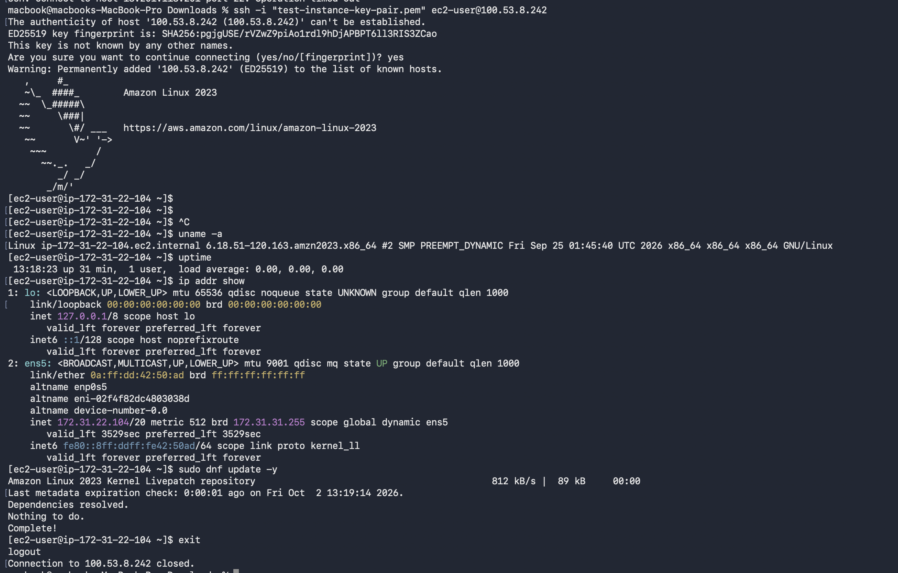

# Lab 02: EC2 Linux Instance Setup & Remote SSH Access

## Executive Summary
Configured and launched an Amazon Linux 2023 EC2 instance in the `us-east-1` (N. Virginia) region. Secured local private key permissions using Unix file attributes and configured VPC Security Group Inbound rules to establish a secure remote SSH session from macOS terminal.

---

## Technical Specifications

| Parameter | Configuration |
| :--- | :--- |
| **AWS Region** | US East (N. Virginia) `us-east-1` |
| **Instance Type** | `t3.micro` |
| **AMI** | Amazon Linux 2023 |
| **Key Pair Type** | ED25519 (`test-instance-key-pair.pem`) |
| **Inbound Protocol** | SSH (Port 22 / TCP) |

---

## Step-by-Step Implementation

### 1. Key Pair Security & Permission Lockout
AWS SSH keys require strict file permission restrictions. Open permissions (such as `0644` or `0755`) trigger an SSH client warning (`UNPROTECTED PRIVATE KEY FILE!`).

Secured the private key permissions on local macOS filesystem:

```zsh
chmod 400 ~/Downloads/test-instance-key-pair.pem

2. Security Group Configuration
Configured an inbound firewall rule on the instance's Security Group to allow SSH connection traffic over Port 22:
Type: SSH
Protocol: TCP
Port Range: 22
Source: 0.0.0.0/0 (Inbound IPv4)

### 3. Remote Connection & System Verification

Connected to the instance over SSH using its Public IPv4 Address and verified system package integrity:
 ssh -i "~/Downloads/test-instance-key-pair.pem" ec2-user@100.53.8.242


Successfully established SSH session to Amazon Linux 2023 instance and executed initial system check commands:



Verification Commands Executed on Instance
Bash
# Verify system details and kernel version
uname -a

# System uptime & load average
uptime

# Network interfaces & IP routing
ip addr show

# System package repository update
sudo dnf update -y 